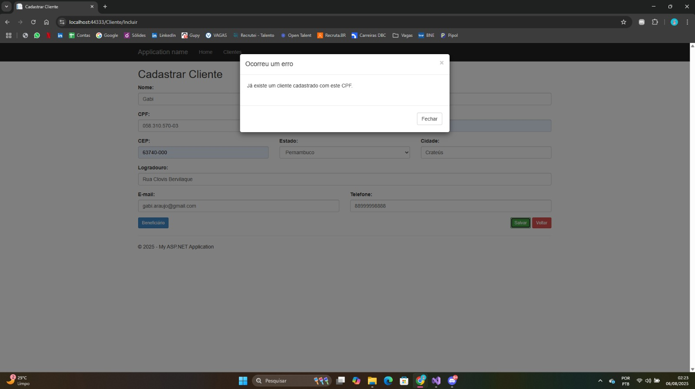
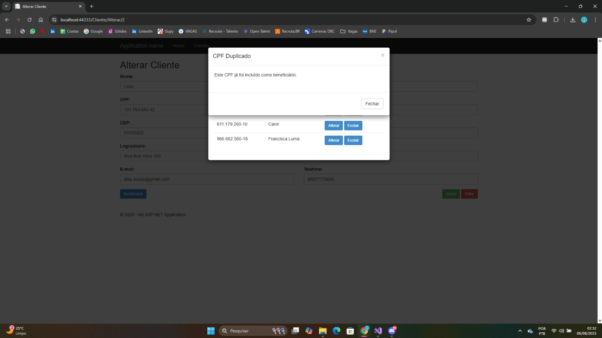
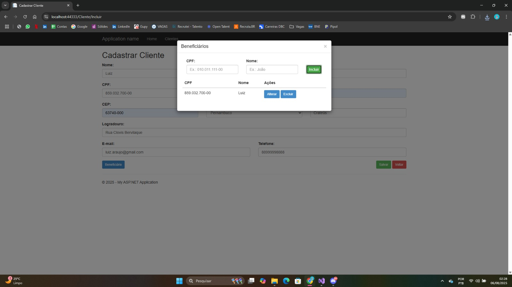

# Projeto-FS-Cadastro-Cliente

## 📝 Visão Geral

A atividade consiste na inclusão do campo de **CPF** no formulário de cadastro de clientes, com aplicação de **formatação** e **validação** adequada.

Também foi solicitado o desenvolvimento de um **modal para gerenciamento de beneficiários**, permitindo a inclusão, edição e exclusão de registros, contendo os campos **"Nome"** e **"CPF"**.

---

## ✅ Features Adicionadas

### Cadastro de Cliente

- Cenario de sucesso do cadastro de cliente.

  📌 Exemplo:
- 

- O formulário de cadastro de cliente **não permite a adição de um CPF já existente** no banco de dados.

  📌 Exemplo:
  

- O campo de CPF possui as seguintes regras:
  - Máscara de formatação: `###.###.###-##`
  - Validação baseada no algoritmo de verificação do dígito verificador do CPF.

  📌 Exemplo:
  

---

### Gerenciamento de Beneficiários

- O modal permite:
  - **Incluir**
  - **Editar**
  - **Remover** beneficiários

- Regras aplicadas:
  - Não é possível adicionar mais de um beneficiário com o **mesmo CPF** para o **mesmo cliente**.

  📌 Exemplo:
  

  📌 Exemplo de inclusão:
  

---

## 🗃️ Banco de Dados

- Foi adicionada a coluna `CPF` na tabela `CLIENTES`.
- Foi criada a tabela `BENEFICIARIOS`, com os campos:
  - `ID`
  - `NOME`
  - `CPF`
  - `IDCLIENTE`
- Foram implementadas stored procedures específicas para o gerenciamento dos beneficiários.

📌 Estrutura:

---

## 🧪 Cenários de Teste

### Cadastro de Cliente

| Cenário | Entrada | Resultado Esperado |
|--------|---------|--------------------|
| CPF Válido e Inexistente | CPF: 123.456.789-09 | Cliente é cadastrado com sucesso |
| CPF Inválido | CPF: 123.456.789-00 | Exibe mensagem de erro de CPF inválido |
| CPF Duplicado | CPF já existente no banco | Exibe mensagem de CPF já cadastrado |

### Cadastro de Beneficiário

| Cenário | Entrada | Resultado Esperado |
|--------|---------|--------------------|
| CPF Válido e único para o cliente | Nome e CPF válidos | Beneficiário é adicionado ao grid |
| CPF Inválido | CPF com dígito verificador errado | Exibe mensagem de erro de CPF inválido |
| CPF duplicado para o mesmo cliente | Mesmo CPF já incluído | Exibe mensagem de erro de CPF já incluído |
| Alterar beneficiário | Selecionar beneficiário e modificar dados | Beneficiário é atualizado corretamente |
| Excluir beneficiário | Clicar em excluir no grid | Beneficiário é removido da lista |